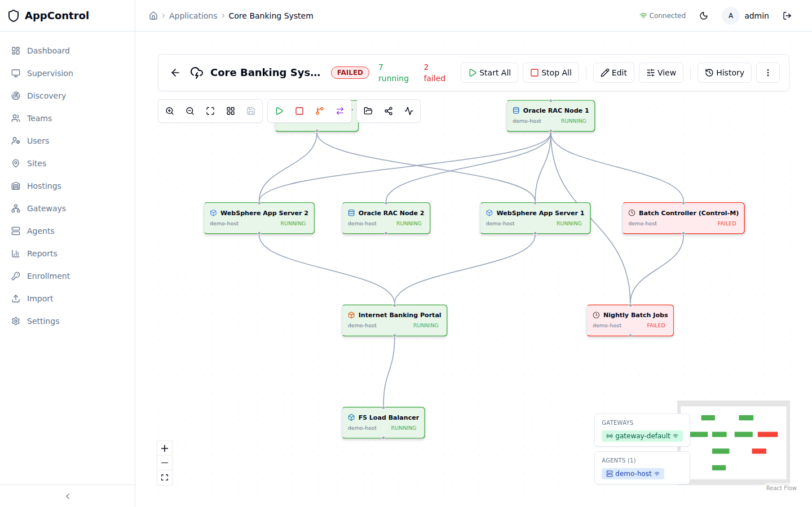

# AppControl

*Read this in [French](README.md) for the full narrative.*

**AppControl is an operational platform for IT resilience.** Built for production teams running mission-critical applications where availability, regulatory traceability and controlled restart are not negotiable: banks, insurance, telecoms, energy, healthcare, critical operators, integrators, MSPs.

It sits **across five families of existing tools** — supervision, CMDB, scheduler, hypervisor, container orchestrator — without replacing any. It adds the layer they were never designed to provide: the *application*, in motion, as a runnable artifact.



[](https://github.com/xcomponent/appcontrol-release/actions/workflows/ci.yaml)
[](https://codecov.io/gh/xcomponent/appcontrol-release)
[](https://github.com/xcomponent/appcontrol-release/releases/latest)
[](#license)

## What it does

- **Dependency maps** — model applications as DAGs (strong / weak dependencies), visualised in React Flow
- **Sequenced operations** — start, stop, restart in DAG order, parallelism within levels
- **3-level diagnostics** — health (process alive?), integrity (data consistent?), infrastructure (OS / prereqs OK?)
- **DR switchover** — 6-phase site failover with rollback at any phase
- **Append-only audit** — DORA-compliant logs for every action, state transition, configuration change
- **Scheduler integration** — REST + `appctl` CLI for Control-M, AutoSys, $Universe, TWS
- **MCP-native** — talk to your production from Claude, ChatGPT, Cursor or any MCP-compatible client

## DORA compliance

Regulation 2022/2554, effective 17 January 2025. AppControl directly addresses **Articles 8** (mapping), **11** (continuity testing), **12** (reconstruction), **16** (incident records), **25** (cyber scenarios). Penalties: up to **2 % of annual global revenue** for the entity, up to **€1M** for executives personally.

See the [French README](README.md#dora--pas-du-confort-une-obligation) for the full *Article → mechanism* table.

## Design safeguards

A platform that *can* stop production *can* break it. AppControl answers by construction, not by procedure: granular 5-level RBAC per application, advisory mode (observe without executing), dry-run on every action, optional PR-only mode (start/stop via merged pull request), mTLS everywhere, append-only audit (no UPDATE, no DELETE, ever). Each application picks its autonomy level (observation → diagnostics → operations → drill → DR) and can step back at any time.

## Three engagement modes

Same product, three angles:

- **Application rebuild** — pilot a 12–24-month modernization program: target DAG modelling, component-by-component validation, clean restarts throughout, regulatory audit delivered at exit.
- **DORA / NIS2 compliance** — append-only signed audit trail as native output, no replacement of the existing ops stack.
- **24/7 on-call enablement** — operators at 3 AM get an immediate application map, controlled restart in the right DAG order, automatic audit — one console to open.

## Tech stack

Rust 1.88+ (agent, gateway, backend) · PostgreSQL 16 or SQLite · React 18 / TypeScript / Vite · mTLS everywhere · Docker + Helm + OpenShift compatible · on-prem, private cloud or full air-gap.

See [QUICKSTART](docs/QUICKSTART.md), [Architecture](docs/architecture.md), [Security](SECURITY_ARCHITECTURE.md), [Positioning](docs/POSITIONING.md).

<!--
Release-only tail appended to README.en.md by
.github/workflows/release.yaml when mirroring the dev repo to
xcomponent/appcontrol-release. Replaces the dev-only "Quickstart" /
"License" sections with their release equivalents (binary install,
no dev workflow, XComponent license). The narrative above the
RELEASE-CUT marker in README.en.md is shared with the dev repo and
is not duplicated here.
-->

## Quick Start

### Option 1 — Docker Compose (Linux / macOS)

```bash
gh release download --repo xcomponent/appcontrol-release --pattern 'docker-compose.release.yaml'
APPCONTROL_VERSION=latest docker compose -f docker-compose.release.yaml up -d
open http://localhost:8080
```

Login: `admin@localhost` / `admin`.

### Option 2 — Standalone PowerShell (Windows / Linux, no Docker)

```powershell
mkdir AppControl; cd AppControl
Invoke-WebRequest -Uri "https://github.com/xcomponent/appcontrol-release/raw/main/appcontrol.ps1" -OutFile appcontrol.ps1

.\appcontrol.ps1 install
.\appcontrol.ps1 start
.\appcontrol.ps1 add-site Production
.\appcontrol.ps1 add-site DR-Site
```

Works on Windows PowerShell 5.1+ and PowerShell Core 6+ (Linux/macOS).

### Option 3 — CLI only (`appctl`)

```bash
gh release download --repo xcomponent/appcontrol-release --pattern 'appctl-linux-amd64' --dir /usr/local/bin
chmod +x /usr/local/bin/appctl-linux-amd64 && mv /usr/local/bin/appctl-linux-amd64 /usr/local/bin/appctl

export APPCONTROL_URL=http://localhost:3000
appctl login --email admin@localhost --password admin
appctl start core-banking --wait --timeout 120
appctl switchover core-banking --target-site lyon --mode FULL --wait
```

## Docker Images

```bash
docker pull ghcr.io/xcomponent/appcontrol-backend:latest
docker pull ghcr.io/xcomponent/appcontrol-frontend:latest
docker pull ghcr.io/xcomponent/appcontrol-gateway:latest
docker pull ghcr.io/xcomponent/appcontrol-agent:latest
docker pull ghcr.io/xcomponent/appcontrol-init-certs:latest
```

## Documentation

Full documentation is included in `appcontrol-docs-scripts.zip`:

- **[QUICKSTART.md](docs/QUICKSTART.md)** — Getting started
- **[USER_GUIDE.md](docs/USER_GUIDE.md)** — Complete user guide with screenshots
- **[WINDOWS_DEPLOYMENT.md](docs/WINDOWS_DEPLOYMENT.md)** — Windows deployment
- **[AGENT_INSTALLATION.md](docs/AGENT_INSTALLATION.md)** — Agent installation (all platforms)
- **[CONFIGURATION.md](docs/CONFIGURATION.md)** — Configuration options
- **[AZURE_GATEWAY.md](docs/AZURE_GATEWAY.md)** — Azure gateway deployment
- **[PRODUCTION_DEPLOYMENT.md](docs/PRODUCTION_DEPLOYMENT.md)** — Production hardening

## Contact

`support@xcomponent.com` — describe your case in three lines: an application name, the scheduler in place, the DR horizon to cover. Reply within 48h.

## License

Copyright (c) 2024-2026 XComponent SAS. All rights reserved.

This software is provided as pre-compiled binaries for evaluation and production use. Redistribution, reverse engineering, and offering as a managed service are prohibited without a commercial license.

Contact: `support@xcomponent.com` for licensing.
